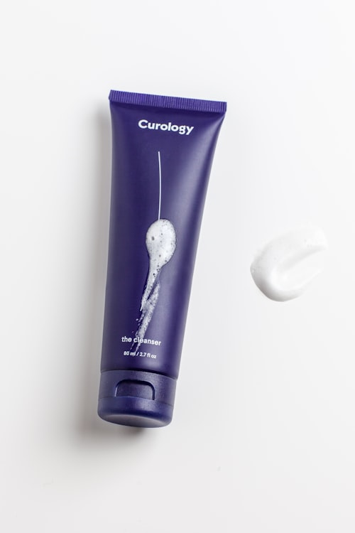

# CheapALot.com 网站全面检测报告

**检测日期**: 2026-07-04  
**检测范围**: 网站结构、多语言、链接、内容、SEO、移动端、功能完整性

---

## 🔴 严重问题（需立即修复）

### 1. 页面缺失 - 所有页脚链接都指向 404 页面
**问题**: 页脚中的关键页面链接都指向不存在的页面
- ❌ `/about.html` - 404 Not Found
- ❌ `/terms.html` - 404 Not Found  
- ❌ `/sell.html` - 404 Not Found
- ❌ `/contact.html` - 404 Not Found

**影响**: 
- 用户点击页脚链接会看到 404 错误页面
- 影响 SEO（搜索引擎发现死链接）
- 降低用户信任度（缺少关于我们、条款等标准页面）

**修复建议**:
- 方案 A: 创建这些缺失的页面（推荐）
- 方案 B: 将链接改为锚点（如 `#about` 指向首页对应部分）

---

### 2. Sitemap.xml 未同步更新 - 仍包含 DE/PL 引用
**问题**: 我们移除了语言切换器中的 DE/PL 链接，但 `sitemap.xml` 仍包含：
```xml
<xhtml:link rel="alternate" hreflang="de" href="https://cheapalot.com/de/"/>
<xhtml:link rel="alternate" hreflang="pl" href="https://cheapalot.com/pl/"/>
```

**影响**:
- 搜索引擎会继续抓取和索引不存在的 DE/PL 页面
- 导致 SEO 问题（搜索引擎看到 404 但 sitemap 说页面存在）

**修复建议**: 立即更新 `sitemap.xml`，移除所有 DE/PL 引用

---

### 3. 产品图片缺失/占位符
**问题**: 
- 产品卡片中的图片路径可能指向不存在的图片
- 例如: `images/products/p1.jpg`, `images/products/p2.jpg` 等
- 分类图片: `images/cat-1.jpg`, `images/cat-2.jpg` 等

**影响**:
- 产品页显示破损的图片图标
- 降低专业度和用户信任
- 影响 SEO（缺少图片 alt 标签）

**修复建议**:
1. 上传真实的产品图片到 `images/products/` 目录
2. 为所有图片添加 alt 属性（SEO 和无障碍访问）
3. 添加图片 CDN 优化（压缩、WebP 格式、尺寸适配）

---

## 🟡 重要问题（建议尽快修复）

### 4. 货币单位本地化不完整
**问题**: 
- 西班牙语版显示 `1p`, `3p`, `12p` 等英货币单位
- 阿拉伯语版显示 `1p`, `15p` 等英货币单位

**影响**:
- 非英国用户可能不理解 `p` (pence) 的含义
- 降低用户体验和专业度

**修复建议**:
- 西班牙语: 改为 `0,01 £` 或 `1 penique`
- 阿拉伯语: 改为 `1 بنس` 或 `0.01£`
- 或统一使用 `£0.01` 格式（国际通用）

---

### 5. 功能组件是静态的（无后端）
**问题**:
- ❌ 产品筛选侧边栏 - 复选框无功能
- ❌ 分页器 - 点击无反应
- ❌ "Add to Cart" 按钮 - 指向 `#` 无功能
- ❌ 搜索框 - 无搜索功能
- ❌ 联系表单 - 无表单处理后端

**影响**:
- 用户体验不完整
- 网站看起来像"演示版"而非完整功能网站

**修复建议**:
- **短期**: 明确标注"功能开发中"或移除交互元素
- **长期**: 添加后端 API 或使用第三方服务（如 Formspree 处理表单）

---

### 6. 西班牙语版的英语翻译残留
**问题**: 西班牙语版中仍有英语内容：
- `1p`, `3p`, `12p` 等货币单位
- `QC` (质量控制) 缩写
- 锚点名称 `inquiry-form` 是英语

**影响**:
- 降低翻译质量和专业度
- 可能影响西班牙语用户的信任

**修复建议**: 全站搜索并替换所有英语翻译残留

---

### 7. 阿拉伯语 RTL 布局检验
**问题**: 
- 需要验证 `dir="rtl"` 是否正确应用到所有元素
- 产品网格、侧边栏筛选器可能需要调整布局

**影响**:
- 如果 RTL 布局不正确，阿拉伯语用户会看到混乱的页面

**修复建议**: 
1. 在浏览器中打开 `https://cheapalot.com/ar/` 检查布局
2. 可能需要添加特定于阿拉伯语的 CSS 调整

---

## 🟢 一般改进建议（优先级较低）

### 8. SEO 优化
**当前状态**:
- ✅ 首页有完整的 meta 标签、Open Graph、Twitter Card
- ✅ 有结构化数据（JSON-LD）
- ❌ 产品页缺少 meta 描述
- ❌ 图片缺少 alt 属性

**改进建议**:
1. 为 `products.html` 添加 meta 描述
2. 为所有图片添加描述性 alt 属性（西班牙语和阿拉伯语版本也要添加对应语言的 alt）
3. 添加面包屑导航（Breadcrumbs）结构化数据

---

### 9. 移动端适配检验
**问题**: 未在实际移动设备上测试

**检验建议**:
1. 使用 Chrome DevTools 的移动端模拟器测试
2. 检查：
   - 导航菜单是否在移动端正常显示（汉堡菜单）
   - 产品网格是否自适应（1列或2列）
   - 筛选侧边栏在移动端是否可用
   - 字体大小是否适合移动端阅读

---

### 10. 性能和加载速度
**问题**:
- 未压缩的图片会降低加载速度
- 没有使用图片 CDN 或延迟加载（Lazy Load）

**改进建议**:
1. 压缩所有图片（使用 TinyPNG 或类似工具）
2. 添加 `loading="lazy"` 属性到图片标签
3. 考虑使用图片 CDN（如 Cloudinary）自动优化

---

### 11. 页脚内容不完整
**问题**: 页脚中的以下链接都指向 `#` 或缺失页面：
- About Us
- Buying From Us
- Sell Your Stock
- Terms & Conditions

**改进建议**: 创建这些页面，或至少创建单页 `about.html` 包含：
- 公司介绍
- 服务说明
- 联系方式
- 条款和条件链接

---

## 📋 优先级修复清单

### 🔴 优先级 1（本周内完成）
- [ ] **创建缺失页面**: about.html, terms.html, sell.html, contact.html
- [ ] **修复 sitemap.xml**: 移除 DE/PL 引用
- [ ] **上传产品图片**: 替换占位符图片
- [ ] **添加 alt 标签**: 所有图片

### 🟡 优先级 2（本月内完成）
- [ ] **货币本地化**: 修复西班牙语和阿拉伯语版的货币显示
- [ ] **移除/禁用静态交互元素**: 或明确标注"开发中"
- [ ] **全站英语翻译残留检查**: 西班牙语和阿拉伯语版
- [ ] **移动端测试和优化**

### 🟢 优先级 3（长期改进）
- [ ] **添加后端功能**: 购物车、搜索、表单处理
- [ ] **性能优化**: 图片压缩、延迟加载、CDN
- [ ] **SEO 增强**: 更多结构化数据、面包屑导航
- [ ] **分析和转化跟踪**: Google Analytics, Facebook Pixel

---

## 🛠️ 具体修复步骤

### 步骤 1: 创建缺失页面（优先级 1）
创建以下页面（可以简单版本开始）:
1. `about.html` - 关于我们
2. `terms.html` - 条款和条件
3. `sell.html` - 出售库存
4. `contact.html` - 联系我们

### 步骤 2: 修复 sitemap.xml
编辑 `/Users/carokk/WorkBuddy/2026-07-04-11-05-45/sitemap.xml`:
- 删除第 10-11 行（DE/PL hreflang）
- 添加新页面的 URL

### 步骤 3: 上传产品图片
1. 准备真实的产品图片
2. 上传到 `images/products/` 目录
3. 确保文件名匹配 HTML 中的引用

### 步骤 4: 添加 alt 标签
为所有 `` 标签添加 `alt` 属性，例如：
```html

```

---

## 📊 总结

| 问题类型 | 严重级别 | 修复难度 | 优先级 |
|---------|---------|---------|-------|
| 页面缺失 (404) | 🔴 严重 | 中 | 1 |
| Sitemap 未同步 | 🔴 严重 | 低 | 1 |
| 产品图片缺失 | 🔴 严重 | 低 | 1 |
| 货币本地化 | 🟡 重要 | 低 | 2 |
| 静态功能组件 | 🟡 重要 | 高 | 2 |
| 英语翻译残留 | 🟡 重要 | 低 | 2 |
| 移动端适配 | 🟡 重要 | 中 | 2 |
| SEO 优化 | 🟢 一般 | 低 | 3 |
| 性能优化 | 🟢 一般 | 中 | 3 |

---

**下一步**: 请确认您希望我首先修复哪些问题，我可以立即开始修复优先级 1 的问题。